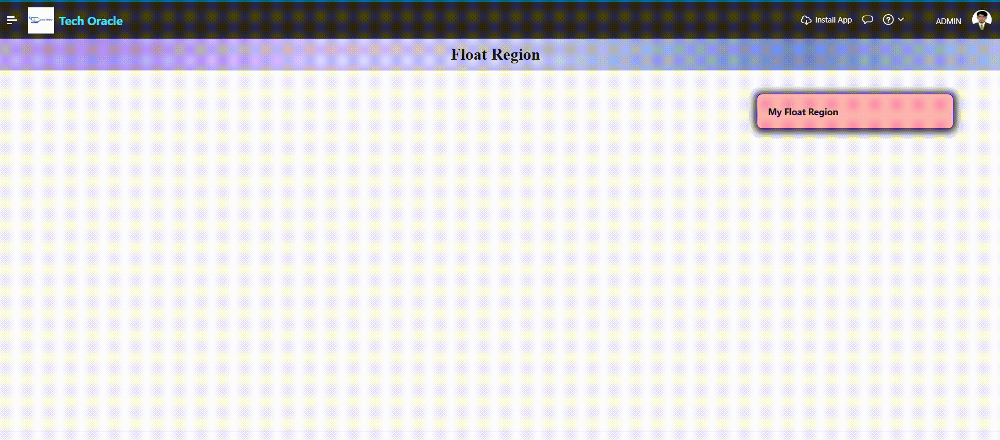

# Drag and Drop Float Region On Oracle APEX
Oracle APEX Float Region — fixed positioning, floating toolbars, and responsive layouts using CSS and Universal Theme utilities

---

### 👉 Introduction

When building enterprise applications with Oracle APEX, user experience is just as important as functionality. One powerful technique that greatly enhances the interface is the **Float Region** — a method of positioning regions on a page so they remain visible, stay fixed while scrolling, or sit side by side in a flexible layout. In this article, we explore what Float Region is, why it matters, and how to implement it effectively in Oracle APEX.

---

### 👉 Why Use Float Regions?

In data-heavy APEX applications — dashboards, reports, and data entry forms — users often need quick access to filters, actions, or navigation controls without scrolling back to the top of the page. Float Regions solve this by:

- Improving **usability** — keeping important controls always visible
- Enhancing **page layout** — placing related content side by side
- Creating a more **professional UI** — comparable to modern web applications

---

### 👉 Implementation Methods
This is the most common use case — a region that stays in place as the user scrolls through the page.

**Steps:**
1. In Page Designer, select your region and set a **Static ID** (e.g., `floatRegion`)
2. Add the following CSS to **Page → CSS → Inline**:

```css
#floatRegion {
    position: fixed;
    top: 5%;
    right: 30%;
    width: 300px;
    z-index: 9999;
    background: #ffadad;
    border: 1px solid #3300ff;
    border-radius: 8px;
    box-shadow: 0 1px 10px 5px #404040;
    cursor: move;
}
```

3. Execute when Page Loads

```JavaScript
$("#floatRegion").draggable({
  containment: "window",
  scroll: false,
  start: function() {
    $(this).css({ right: "auto" });
  },
  stop: function() {
    var pos = $(this).position();
    console.log("Position: top=" + pos.top + " left=" + pos.left);
  }
});
```

### 🎬 Demo Video


### 👉 Conclusion

Float Regions are a simple yet powerful technique in Oracle APEX that can significantly elevate your application's user experience. Whether you need a sticky toolbar, a side-by-side dashboard layout, or a floating action button, Oracle APEX provides the tools — from built-in utility classes to custom CSS and region templates — to implement them cleanly and efficiently.

Mastering Float Regions is a practical step toward building modern, professional-grade APEX applications that users love to work with.

